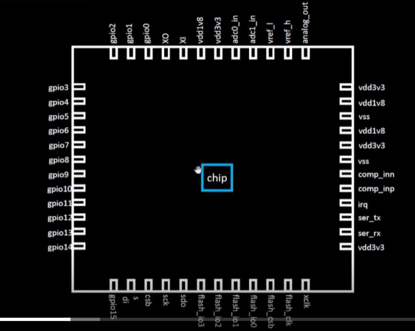
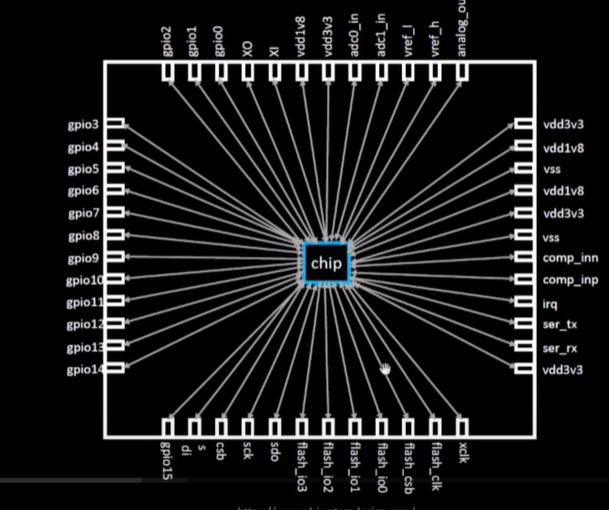
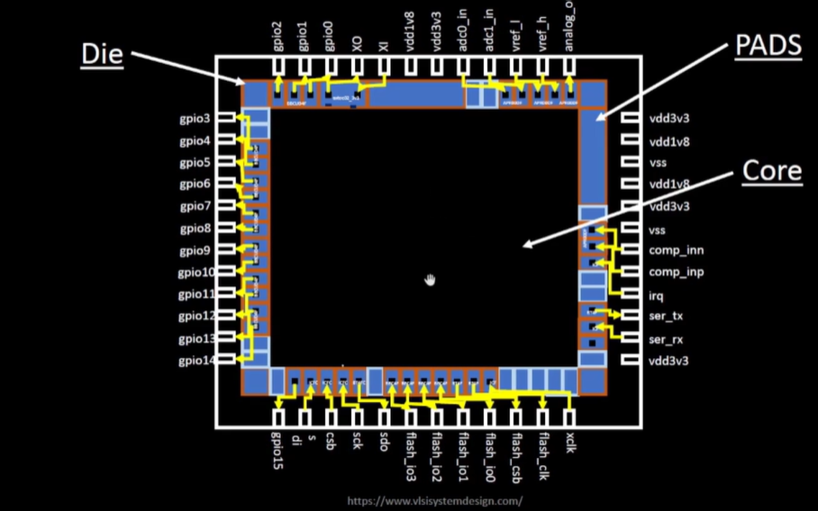
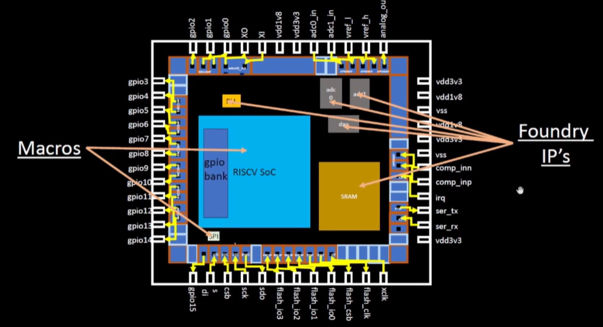

# Day-1
## How to talk to computers
### Introduction to QFN-48 package, chip, pads, core, die and IPs
The thing that we call a chip is actually a package. The chip is only a part inside the package.
  
  
The chip is connected to the outside world by wires and it is known as a wire-bound connection.
  
  
Die: A die is a piece of semiconducting material on which the circuit is fabricated.  
Core: The core is the part of the chip where all the logic is present.  
Pads: The pads are the area that encompass the core.  
  
  
The core consists of 2 types of parts : Foundry IPs and Macros.  
Parts such as the ADCs, SRAM, etc. are known as Foundry IP(Intellectual Property)s and parts such as the RISC-V SoCs and SPIs are called Macros.  
IPs are the parts which require intelligence to build. Macros do not require any intelligence to build.  
  

## Introduction to RISC-V
An Instruction Set Architecture (ISA) is a conceptual model that defines how a computer's software controls its hardware. It's a set of rules that specify what a processor can do and how it does it. RISC-V is an open-source Instruction Set Architecture (ISA).

## From Software to Hardware
Now let us see how the instructions we give to the computer in a programming language such as C, C++, Java, etc. or from apps are conveyed to the processor.
![]
