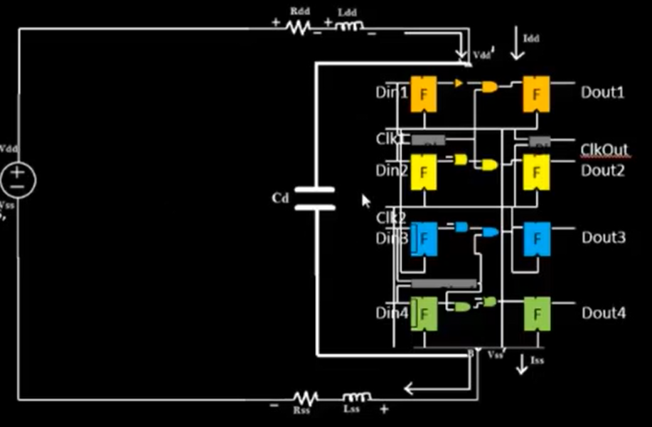

# Day-1
## How to talk to computers
### Introduction to QFN-48 package, chip, pads, core, die and IPs
The thing that we call a chip is actually a package. The chip is only a part inside the package.
  
  
The chip is connected to the outside world by wires and it is known as a wire-bound connection.
  
  
Die: A die is a piece of semiconducting material on which the circuit is fabricated.  
Core: The core is the part of the chip where all the logic is present.  
Pads: The pads are the area that encompass the core.  
  
  
The core consists of 2 types of parts : Foundry IPs and Macros.  
Parts such as the ADCs, SRAM, etc. are known as Foundry IP(Intellectual Property)s and parts such as the RISC-V SoCs and SPIs are called Macros.  
IPs are the parts which require intelligence to build. Macros do not require any intelligence to build.  
  

### Introduction to RISC-V
An Instruction Set Architecture (ISA) is a conceptual model that defines how a computer's software controls its hardware. It's a set of rules that specify what a processor can do and how it does it. RISC-V is an open-source Instruction Set Architecture (ISA).

### From Software to Hardware
Now let us see how the instructions we give to the computer in a programming language such as C, C++, Java, etc. or from apps are conveyed to the processor.
  
The Operating System (OS) of the computer consists of a Compiler and an Assembler. When we give inputs from applications or in a programming language, the Compiler converts the code into Instruction files (*.exe files). This is passed into the Assembler, which converts the instruction file in to Binary numbers. This is then fed to the processor which performs the operation.
  
## SoC flow and openLANE
### Components of ASIC design
ASIC stands for Application-Specific Integrated Circuit. It is a chip used to perform a specific task.  
ASIC design requires 3 important parts:  
1. EDA (Electronic Design Automation). It consists of the tools we need to design an ASIC. Some open-source EDA tools include : Qflow, openROAD and openLANE.  
2. RTL (Register Transfer Level). It consists of the designs we need to design an ASIC. Some open-source RTLs include : librecores.com, opencores.com and github.com.  
3. PDK (Process Design Kit). It consists of the data we need to design an ASIC. An open-source PDK is Skywater 130nm.  

### Simplified RTL to GDS flow
GDS files are the final output of the ASIC design cycle.  
The process from RTL to GDS contains 6 important steps.They are:  
1. Synthesis : It is the process of converting the RTL to a circuit out of components from the Standard Cell Library (SCL).  
2. Floor and Power Planning : It is the process of partitioning the chip die between different system building blocks and placing the Input/Output pads and placing the Power pads.  
3. Placement : It is the process of placing the cells on the floorplan rows, aligned with the sites.  
4. Clock Tree Synthesis : It is the process of creating a Clock distribution network.  
5. Routing : It is the process of implementing the interconnect using the available metal layers.  
6. Sign-Off : It is the process of verifying the ASIC by verifying the physical design using 2 methods : Design Rule Checking (DRC), and Layout vs. Schematic (LVS). and verifying the timing with Static Timing Analysis.  

### OpenLane detailed ASIC design flow
This is the diagram of the detailed openLANE ASIC design flow.  
   

### Flop Ratio
Flop Ratio = Number of D Flip Flops / Total Number of cells  
           = 1613 / 14876  
           = 0.1084  
Flop Percentage = Flop Ratio x 100  
                = 0.1084 x 100  
                = 10.84  

# Day-2
## Chip Floor-Planning Considerations
### Utilization Factor and Aspect Ratio
Utilization Factor is defined as the total area occupied by the circuit by the total area of the core.  
Utilization Factor = Total area occupied by circuit / Total area of core  
The Aspect ratio is defined as the height of the core by width of the core.  
Aspect ratio = Height / Width  
Let us take an example of a circuit which occupies 4 sq.units placed in a core of dimensions 2units x 2units.  
Utilization factor = total area occupied by circuit / total area of core  
                   = 4 sq.units / 2units x 2 units  
                   = 4 sq.units / 4 sq.units  
                   = 1  
Aspect Ratio = Height / Width   
             = 2 / 2  
             = 1  
A Utilization Factor of 1 indicates that the area of the core is totally occupied and additional components cannot be added.    
An Aspect Ratio of 1 indicates that the core is square-shaped.  

  ### Pre-Placed Cells
  A large circuit or netlist can be divided into 2 parts to simplify the connections.  
    
  
  These 2 parts are now 2 circuit blocks.  Now we can remove the connections between the 2 different blocks and extend them as I/O pins. These 2 modules can be used separately as IPs (Intellectual Property) or modules.    
    
    

- The arrangement of these IPs in a chip is referred to as floor-planning.
- These IPs have user-defined locations and hence, are placed in chips before automated placement-and-routing and are known as "Pre-Placed Cells"

### Decoupling Capacitors
Let us take an example where the physical distance between the power source and the pre-placed cell is large.  
  
When the logic '0' is shifted to logic '1', there is a voltage drop between the power source and the cell. If this drop is a very small amount of voltage, there will be no problem, but when the drop is substantial, the input will not be considered as logic '1'.  
  
We can solve this problem by adding a decoupling capacitor, whenever the logic shifts from logic '0' to logic '1', the circuit will get the required charge from the capacitor, and whenever the circuit is idle, the capacitor will replenish its charge from the power source

### Power Planning
Let us take an example where 4 different pre-placed cells connected to decoupling capacitors are connected to a common power source. The output of a certain cell has to deliver the signal to the inverter of another cell through a 16-bit bus.  
  
  

What could go wrong here ?
The 16-bit bus cannot be connected to the power source as the distance could cause a voltage drop. As a result, when it is connected to the inverter, the decoupling capacitors that are connected to a voltage will discharge all at the same time to ground, and the decoupling capacitors which are discharged will get charged to the voltage all at the same time.  
Therefore, the capacitors which are discharging will cause a ground bounce and the charging capacitors will cause a voltage drop. This will make the circuit fail.  
A solution to this is placing many power sources at many points in the chip, so that the 16-bit bus can be connected directly to power wiithout risking a voltage drop.  

  

This is called Power Planning.

### Pin Placement and Logical Cell Placement Blockage
Pin Placement is nothing but placing the input and output pins of the chip strategically so that cells with connectivity to the same pin can be connected without difficulty.  
  Logical Cell Placement Blockage is the process of reserving the part where the pins are placed so that cells are not placed mistakenly over there.  
  
